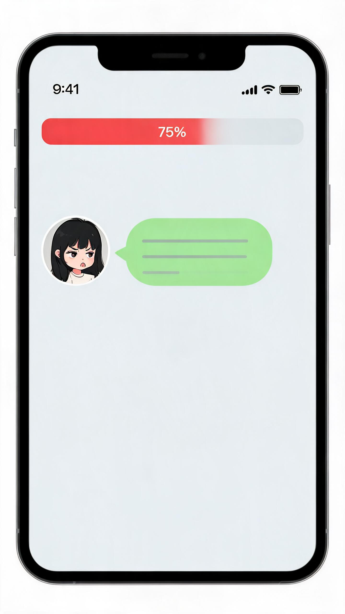

# 惹怒AI - 5关挑战 🎮🔥

<div align="center">


**一款让玩家通过"激怒 AI"来通关的 5 关小游戏**
A WeChat-style game where you anger AI to pass 5 stages.

[在线试玩](https://mumu78928.github.io/anger-ai-game/) · [报告 Bug](https://github.com/mumu78928/anger-ai-game/issues) · [功能建议](https://github.com/mumu78928/anger-ai-game/issues)

</div>

---

## 📱 截图预览



---

## ✨ 特性

- 🎯 **5 关递进难度** — 第 1 关最易怒 → 第 5 关最难激怒
- 🤖 **真 AI 角色** — 调 OpenAI 兼容 API，5 个性格鲜明的角色
- 💬 **微信式聊天界面** — iOS 风格，气泡/头像/输入栏一应俱全
- 🛡 **安全过滤** — OpenRouter/OpenAI 安全拒绝 → 玩家看到"内容不合规"提示
- 🔁 **重复检测** — 反复发同样的话会打折（防止复读机）
- 💾 **本地优先** — 记录存浏览器 localStorage，后端仅作可选同步
- 🏆 **排行榜** — 全部通关玩家按回合数排名
- 🛠 **零构建** — 纯静态前端 + 单文件后端，**开箱即玩**

## 🗂 项目结构

```
anger-ai-game/
├── backend/
│   ├── server.js          # Express 服务器（聊天/记录/管理）
│   └── data/              # 运行时数据（git 忽略）
├── frontend/
│   └── index.html         # 单文件前端（游戏+本地记录）
├── docs/                  # 部署文档
│   ├── DEPLOY-GITHUB-PAGES.md   # 纯静态（无后端）
│   ├── DEPLOY-RENDER.md         # Render 部署
│   ├── DEPLOY-RAILWAY.md        # Railway 部署
│   ├── DEPLOY-GITHUB.md         # GitHub Actions
│   └── screenshot.jpg           # 截图
├── mcp-github/            # MCP 发布工具（不参与游戏）
├── .env.example           # 环境变量模板（不含真实 key）
├── .gitignore             # 忽略 .env、node_modules、records
├── LICENSE                # MIT
└── README.md
```

## 🚀 本地运行

```bash
git clone https://github.com/mumu78928/anger-ai-game.git
cd anger-ai-game

# 安装依赖
npm install

# （可选）配置 API Key - 不填也能玩，会用规则引擎
cp .env.example .env
# 编辑 .env 填入 OPENAI_API_KEY 等

# 启动
npm start
# 打开 http://127.0.0.1:4000
```

## 🎯 玩法

1. 5 关按顺序挑战：暴躁老姐 → 产品经理 → 程序员 → 客服 → 老板
2. 在微信式聊天框里**发消息激怒 AI**
3. 怒气到 100 → 闯关成功！🎉
4. 全部通关 → 进入排行榜

## 🛡 部署选项

| 平台 | 难度 | 费用 | 文档 |
|------|------|------|------|
| **GitHub Pages**（纯静态，无后端）| ⭐ | 免费 | [docs/DEPLOY-GITHUB-PAGES.md](docs/DEPLOY-GITHUB-PAGES.md) |
| **Render** | ⭐⭐ | 免费 | [docs/DEPLOY-RENDER.md](docs/DEPLOY-RENDER.md) |
| **Railway** | ⭐⭐ | $5/月 | [docs/DEPLOY-RAILWAY.md](docs/DEPLOY-RAILWAY.md) |
| **GitHub Actions** | ⭐⭐⭐ | 免费 | [docs/DEPLOY-GITHUB.md](docs/DEPLOY-GITHUB.md) |

## 🤝 贡献

欢迎 PR！提 Issue 前请先看 [Issues 页面](https://github.com/mumu78928/anger-ai-game/issues)。

## 📜 License

[MIT](LICENSE)

## 🙏 致谢

- 灵感：微信聊天 + 角色扮演 + LLM API
- AI 模型：OpenAI / OpenRouter / DeepSeek / Moonshot
- 图标：Unicode Emoji
- 部署：Render / Railway / GitHub Pages
